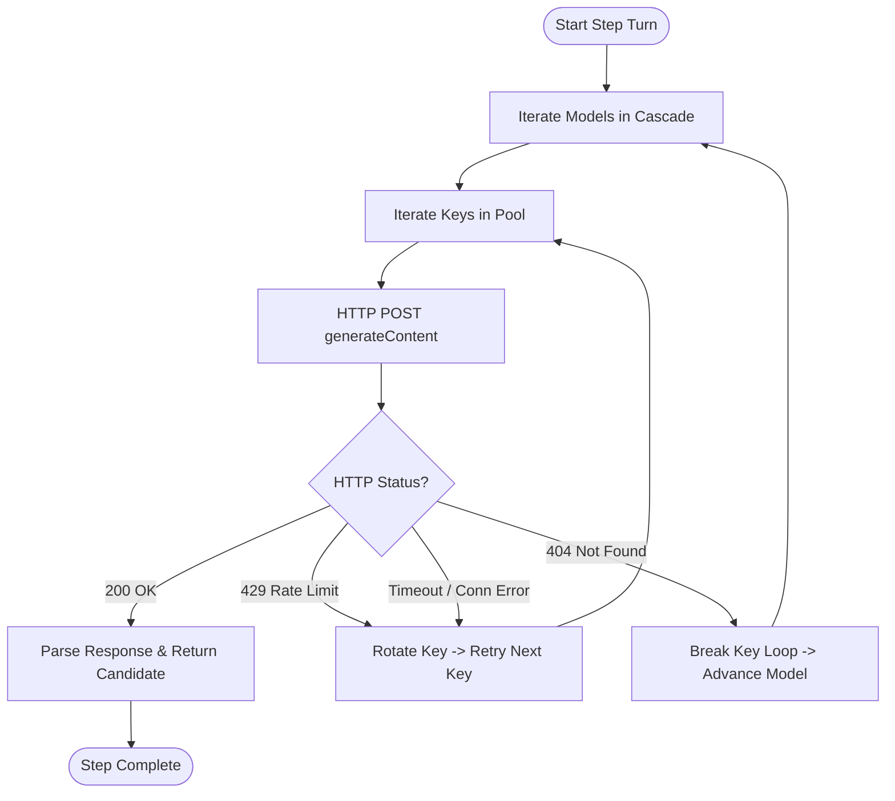

# Autonomous Agent Core & ReAct Engine

This document provides a comprehensive technical deep dive into the AI reasoning core of Helmis: the autonomous multi-step ReAct loop, the dynamic Google Gemini model cascade, the multi-key round-robin quota manager, the 12 agentic tools, context assembly, and the state fidelity guardrail system.

---

## 1. Dynamic Gemini Model Cascade

Helmis interacts directly with Google's Generative Language API via raw, asynchronous HTTP requests using `httpx`. It does not rely on heavy vendor SDKs, allowing complete control over timeouts, payload shapes, and failover behavior.

### Discovery & Speed Prioritization (`fetch_available_gemini_models`)

At startup, Helmis dynamically queries `https://generativelanguage.googleapis.com/v1beta/models` using the configured API keys. It inspects all available models supporting the `generateContent` method, filters out non-conversational models (e.g. robotics, computer-use, TTS), and applies an intelligent tier-ranking sort:

```python
def score_model(m: str) -> int:
    m_lower = m.lower()
    if "flash-lite" in m_lower or "flash_lite" in m_lower:
        return 1  # Tier 1: Sub-second latency, lightweight
    elif "flash" in m_lower:
        return 2  # Tier 2: Standard high-speed multimodal
    elif "gemma" in m_lower:
        return 3  # Tier 3: Open-weight hosted models
    elif "pro" in m_lower:
        return 4  # Tier 4: Heavyweight deep reasoning
    return 5
```

### Static Fallback List
If the dynamic query fails (e.g. temporary network partition at container boot), the system defaults to a hardcoded cascade:
1. `gemini-3.1-flash-lite`
2. `gemini-3.5-flash-lite`
3. `gemini-3.1-flash-lite-preview`
4. `gemini-flash-lite-latest`
5. `gemini-3.5-flash`
6. `gemini-3.6-flash`
7. `gemini-3.7-flash`
8. `gemini-2.5-flash`
9. `gemini-flash-latest`
10. `gemini-3.1-pro-preview`
11. `gemini-2.5-pro`
12. `gemini-pro-latest`

---

## 2. Multi-Key Round-Robin & Quota Management

To operate reliably on Google AI Studio's free tier without hitting per-minute Request Per Minute (RPM) or Token Per Minute (TPM) limits, Helmis supports an arbitrary number of Gemini API keys configured as environment variables (`GEMINI_KEY_1`, `GEMINI_KEY_2`, `GEMINI_KEY_3`, ..., `GEMINI_KEY_N`).

### Rotation Logic (`get_next_gemini_key`)
- Keys are loaded into `GEMINI_KEYS: list[str]` on module import.
- Calls to `get_next_gemini_key()` rotate sequentially across keys using a global atomic counter modulo `len(GEMINI_KEYS)`.
- During an active turn, if a request receives a `429 Too Many Requests` status or a connection timeout, the loop immediately rotates to the next key without failing the turn.
- If a model returns `404 Not Found` (model deprecated or unavailable on that endpoint), the cascade immediately advances to the next model in the cascade.



---

## 3. Tool Calling Protocol & Function Declarations

Helmis defines **12 native tools** exposed directly to Gemini via OpenAI/Gemini-compatible `function_declarations`.

### Complete Tool Specifications

#### 1. `add_task`
- **Purpose**: Persist a new task, appointment, deadline, or reminder.
- **Parameters**:
  - `title` (*string, required*): Description of the task/reminder.
  - `due` (*string, required*): Target date and time in WIB (e.g. `'2026-08-26 18:00 WIB'`).
  - `assignee` (*string, optional*): Responsible person (`'Gilang'` or `'Bunga'`, defaults to sender).
- **Behavior**: Checks for existing pending tasks with matching titles to prevent duplicates.

#### 2. `list_tasks`
- **Purpose**: Inspect active or historical tasks from storage.
- **Parameters**:
  - `status` (*string, optional*): `'pending'`, `'completed'`, or `'all'` (default `'pending'`).
- **Behavior**: Returns structured array of matching tasks with deadlines and reminder flags.

#### 3. `complete_task`
- **Purpose**: Mark an active task as completed when a user confirms it is finished.
- **Parameters**:
  - `title` (*string, required*): Task title or keyword substring.
- **Behavior**: Updates task status to `completed` and attaches `completed_at` timestamp.

#### 4. `update_task`
- **Purpose**: Modify an existing task's deadline, assignee, or title.
- **Parameters**:
  - `title` (*string, required*): Existing task keyword to search for.
  - `new_title` (*string, optional*): Updated title.
  - `new_due` (*string, optional*): Updated deadline in WIB.
  - `new_assignee` (*string, optional*): `'Gilang'` or `'Bunga'`.
- **Behavior**: Mutates the first matching pending task in storage.

#### 5. `delete_task`
- **Purpose**: Completely remove a task from persistent storage.
- **Parameters**:
  - `title` (*string, required*): Title or keyword of the task to delete.
- **Behavior**: Purges matching tasks from JSON storage.

#### 6. `add_person`
- **Purpose**: Save or update a contact in the people directory.
- **Parameters**:
  - `name` (*string, required*): Contact name or alias.
  - `phone` (*string, optional*): Phone number.
  - `role` (*string, optional*): Relationship or role (e.g. `'Gilang manager'`, `'Dokter anak'`).
  - `notes` (*string, optional*): Preferences, addresses, or important context.

#### 7. `get_person`
- **Purpose**: Retrieve contact details and background notes for a person.
- **Parameters**:
  - `name` (*string, required*): Name or alias to search for.

#### 8. `save_note`
- **Purpose**: Store a shared note, memo, list, or key fact.
- **Parameters**:
  - `title` (*string, required*): Note title.
  - `content` (*string, required*): Note body.

#### 9. `delete_note`
- **Purpose**: Delete a note by title keyword match.
- **Parameters**:
  - `title` (*string, required*): Title keyword of note to delete.

#### 10. `remember_fact`
- **Purpose**: Store a durable personal fact or preference in episodic semantic memory.
- **Parameters**:
  - `fact` (*string, required*): Verbatim fact or preference.
  - `user_id` (*string, optional*): `'Gilang'`, `'Bunga'`, or `'Both'`.
- **Behavior**: Calculates 3072-dimensional embedding and stores in `semantic_memories.json`.

#### 11. `delete_memory`
- **Purpose**: Delete personal facts from semantic vector memory.
- **Parameters**:
  - `query` (*string, required*): Keyword or semantic query to purge.
  - `user_id` (*string, optional*): Target user.

#### 12. `recall_memory` / `search_memory`
- **Purpose**: Search vector embeddings (`recall_memory`) or full text across all tables (`search_memory`).
- **Parameters**:
  - `query` / `keyword` (*string, required*): Search term.

#### 13. `send_whatsapp_message`
- **Purpose**: Proactively send a WhatsApp message to Gilang, Bunga, or the Trio group chat.
- **Parameters**:
  - `recipient` (*string, required*): `'Gilang'`, `'Bunga'`, `'group'`, or phone number.
  - `text` (*string, required*): Message text with ZERO EMOJIS.
  - `quote_message_id` (*string, optional*): WhatsApp message ID to quote.

#### 14. `get_whatsapp_messages`
- **Purpose**: Fetch verified WhatsApp chat history with optional date range filters.
- **Parameters**:
  - `target` (*string, required*): `'Gilang'`, `'Bunga'`, or `'Group'`.
  - `date` (*string, optional*): `'today'`, `'yesterday'`, or `'YYYY-MM-DD'`.
  - `since_hours_ago` (*integer, optional*): Number of hours to look back.
  - `limit` (*integer, optional*): Max messages (default 20, max 50).

---

## 4. Multi-Turn Context Assembly (`build_multi_turn_contents`)

Gemini requires strictly alternating `user` and `model` role turns in its `contents` payload. Helmis formats recent WhatsApp chat history while respecting speaker identities and media context:

1. **Chronological Sorting**: Messages retrieved from WAHA are sorted oldest to newest by Unix timestamp.
2. **Speaker Tagging**:
   - Inbound messages from users are prefixed with their resolved name: `[Gilang]: ...` or `[Bunga]: ...`.
   - Outbound messages sent by the bot (identifiable by `true_` message ID prefix or matching `BOT_PHONE`) are assigned the role `model`.
3. **Turn Merging**: Consecutive messages with the same role are coalesced into a single turn part separated by newlines, preventing API schema validation errors.
4. **Multimodal Native Parts**: If the active turn contains an image or document, an `inlineData` part containing MIME type and base64 payload is attached directly to the active `user` turn.

---

## 5. State Fidelity Guardrail System

Large Language Models frequently suffer from sycophancy, claiming an operation succeeded even when the underlying tool reported failure or an item was not found. Helmis eliminates this via a two-layer guardrail system.

### Layer 1: Tool Output Directives (`inject_tool_directive`)
Whenever a tool finishes execution, `inject_tool_directive()` injects unambiguous guidance into the `_model_directive` property of the JSON result before returning it to the LLM:

```python
if status == "not_found":
    result["_model_directive"] = (
        f"CRITICAL HONESTY: Item for '{func_name}' was NOT found. You MUST explicitly tell the user that the data/memory does not exist or was never stored in the database. DO NOT pretend or claim that you found, deleted, or updated it!"
    )
elif status == "error":
    result["_model_directive"] = (
        f"CRITICAL HONESTY: Tool '{func_name}' failed with an error. State the error honestly to the user and do NOT claim success."
    )
```

### Layer 2: Action Fidelity Verification (`verify_action_fidelity`)
After the ReAct loop concludes and the model generates its finalized text response, `verify_action_fidelity()` inspects all executed mutation tools in the turn. If all mutation tools returned `not_found` or `error`, the guardrail overrides any hallucinated pleasantries with the ground-truth database status message:

```python
def verify_action_fidelity(text: str, executed_tools: list[dict[str, Any]]) -> str:
    if not executed_tools:
        return text

    mutation_tools = [t for t in executed_tools if t.get("name") in (
        "delete_memory", "delete_note", "delete_task", "complete_task", "update_task", "send_whatsapp_message"
    )]

    if mutation_tools:
        all_not_found = all(t.get("result", {}).get("status") == "not_found" for t in mutation_tools)
        if all_not_found:
            last_res = mutation_tools[-1].get("result", {})
            msg = last_res.get("message")
            if msg and isinstance(msg, str):
                return msg  # Enforces verified database message

    return text
```

---

## 6. Voice Notes & Multimodal Ingestion Pipeline

WhatsApp Voice Notes (PTT audio) and media attachments require specialized handling.

### Phase 1: Isolated Verbatim Speech Transcription (`transcribe_audio_base64`)
When an inbound audio file (OGG/Opus, MP3, AAC, M4A) is received:
1. The binary is downloaded via `WahaClient.download_media_base64()`.
2. A dedicated Gemini API call is executed with `temperature=0.0` and a strict system instruction:
   > *"Transcribe this audio verbatim in the original spoken language (Indonesian or English). Output ONLY the exact words spoken without quotation marks, markdown, preamble, or commentary."*
3. If the audio is silent or unintelligible, it returns a polite clarification request (`> "(Audio tidak terdengar jelas)"`).

### Phase 2: Conversational Reasoning & Quoted Reply
1. The verbatim transcription is fed into the ReAct agent loop as the user's input text.
2. The agent executes relevant tools (e.g. adding a reminder mentioned in the voice note).
3. The final response is formatted with a WhatsApp quote block displaying the transcription above the assistant's reply:
   ```
   > "Tolong ingatkan besok pagi beli susu"

   Sip, task *Beli susu* sudah dicatat untuk besok pagi 08:00 WIB.
   ```

### Document & Image OCR
For images (JPEG/PNG) and documents (PDF):
- The file is encoded into base64 and passed directly into the Gemini multimodal vision pipeline.
- The system prompt instructs the agent to extract actionable structured data (amounts, due dates, invoice numbers, meeting dates) directly without generating conversational filler or unsolicited visual descriptions.
