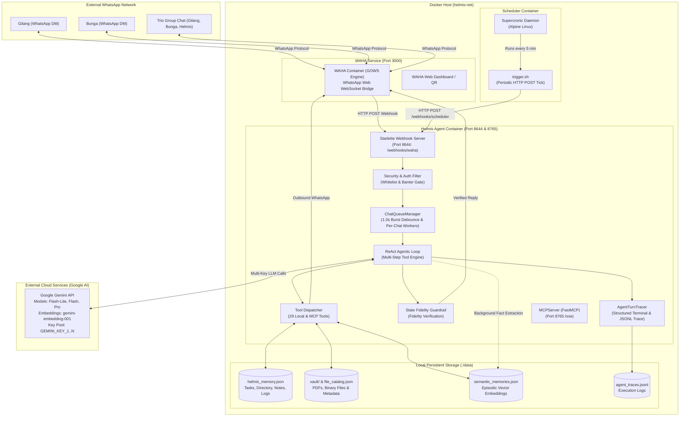

# System Architecture & Component Design

This document provides a deep architectural breakdown of **Helmis**, covering high-level system topology, container orchestration, network routing, and the multi-tier message execution pipeline.

---

## 1. System Topology Overview

Helmis is an autonomous, multi-step AI executive secretary built to operate 24/7 on a private server (VPS). It bridges WhatsApp communication with Google Gemini LLMs, persistent JSON storage, and a vector semantic memory store.



---

## 2. Container Network & Deployment Topology

The entire system is orchestrated via `docker-compose.yml` on a dedicated Docker bridge network (`helmis-net`).

### Services & Port Mappings

| Container Name | Base Image / Context | Internal Port | Exposed Port | Purpose |
|---|---|---|---|---|
| `helmis-waha` | `devlikeapro/waha:latest` | `3000` | `3005:3000` (Configurable) | WhatsApp Web WebSocket bridge (GOWS engine) + Dashboard |
| `helmis-agent` | `./helmis-agent` (Python 3.12-slim) | `8644`, `8765` | `8644` (Internal), `8765` (Internal) | Core AI ReAct Brain, Webhooks, Storage, MCP SSE server |
| `helmis-scheduler` | `./scheduler` (Alpine + Supercronic) | N/A | N/A | Crontab runner triggering proactive check evaluations |

### Persistent Volume Architecture

```
Host Filesystem
├── ./data/                                  <== Mounted into /app/data:z
│   ├── helmis_memory.json                   # Structured persistent state (tasks, notes, contacts)
│   ├── file_catalog.json                    # Metadata catalog for Document Vault
│   ├── vault/                               # Binary PDFs, photos, scans, receipts & workspaces
│   ├── semantic_memories.json               # Episodic vector embeddings & facts
│   └── agent_traces.jsonl                   # Step-by-step turn execution traces
│
├── ./config/                                <== Mounted into /hermes-config:ro,z
│   ├── system-prompt.md                     # System prompt & personality directives
│   └── skills/                              # Specialized secretary playbooks (Markdown)
│
└── waha-sessions (Docker Volume)            <== Mounted into /app/.sessions
    └── ...                                  # WhatsApp Web token session files
```

### Healthcheck & Dependency Graph

1. **`helmis-waha`**:
   - Healthcheck: `wget -qO- http://localhost:3000/ping` every 10s.
2. **`helmis-agent`**:
   - Depends on: `helmis-waha` with `condition: service_healthy`.
   - Healthcheck: Python script testing `http://localhost:8644/health` (which verifies WAHA connectivity via `WahaClient.is_reachable()`).
3. **`helmis-scheduler`**:
   - Depends on: `helmis-agent`.

---

## 3. End-to-End Turn Execution Lifecycle

The diagram below details the 6-phase processing lifecycle of an inbound WhatsApp message from delivery to response dispatch.

```mermaid
sequenceDiagram
    autonumber
    actor User as Gilang / Bunga
    participant WAHA as WAHA (Bridge)
    participant WH as Webhook Receiver (/webhooks/waha)
    participant Queue as ChatQueueManager (Debouncer)
    participant Agent as ReAct Agent Loop
    participant Gemini as Google Gemini API
    participant Mem as Local Storage (JSON & Vector)

    User->>WAHA: Sends WhatsApp message (Text / Image / Voice Note)
    WAHA->>WH: HTTP POST /webhooks/waha (JSON payload)
    
    Note over WH: Stage 1: Ingestion & Auth Validation
    WH->>WH: Validate Sender Phone / LID against Whitelist
    WH->>WH: If Group: Check mention (@helmis, 'mis ') or drop banter
    WH->>WH: Deduplicate message ID (60s in-memory cache)
    
    WH->>Queue: Dispatch IncomingMessageEvent
    Note over Queue: Stage 2: 1.0s Burst Debounce Window
    Queue->>Queue: Coalesce rapid consecutive messages into single prompt
    
    Queue->>WAHA: Send 'startTyping' indicator
    
    opt Multimodal Ingestion (Audio / Voice Note)
        Queue->>WAHA: Download media binary
        Queue->>Gemini: Phase 1: Transcribe audio verbatim (temp=0.0)
        Gemini-->>Queue: Return exact transcription text
    end

    Note over Agent: Stage 3: ReAct Agent Loop (max 5 steps)
    Agent->>Mem: Load system prompt, active skills & structured memory context
    Agent->>Mem: Semantically search vector memory for relevant personal facts
    Agent->>WAHA: Fetch recent chat history (last 12 messages)
    Agent->>Agent: Construct multi-turn contents with sender tags
    
    loop ReAct Multi-Step Iteration
        Agent->>Gemini: POST generateContent (Payload + Tools + Round-Robin Key)
        alt Model requests Function Call
            Gemini-->>Agent: return functionCall(name, args)
            Agent->>Mem: Execute local tool (add_task, search_memory, etc.)
            Mem-->>Agent: Tool result dictionary
            Agent->>Agent: Inject State Fidelity Directive (_model_directive)
            Agent->>Agent: Append functionCall & functionResponse to turn history
        else Model generates Final Response
            Gemini-->>Agent: return final text response
        end
    end

    Note over Agent: Stage 4: Guardrail Verification
    Agent->>Agent: verify_action_fidelity(text, executed_tools)
    
    Note over Agent: Stage 5: Outbound Dispatch
    Agent->>WAHA: Send message to chat_id (with quote_id if VN/media)
    WAHA->>User: Deliver formatted WhatsApp message
    Agent->>WAHA: Send 'stopTyping' indicator

    Note over Agent: Stage 6: Background Episodic Fact Extraction
    par Background Fact Extraction
        Agent->)Gemini: Analyze turn for durable personal facts/preferences
        Gemini--)Agent: Return JSON array of extracted facts
        Agent->)Mem: Store new facts with 3072-dim embeddings in semantic_memories.json
    end
```

---

## 4. Multi-Tier Processing Pipeline Breakdown

### Tier 1: Ingress & Security Gatekeeper
- **Source**: `helmis-agent/src/webhook.py`
- Inbound payloads from WAHA are filtered through three sequential validation gates:
  1. **Deduplication Filter**: Messages seen within the last 60 seconds are discarded immediately (`_seen_message_ids`).
  2. **Identity Whitelist**: Sender phone numbers and WhatsApp Linked Device Identifiers (LIDs) must match `GILANG_PHONE`, `BUNGA_PHONE`, or known account hashes. Unrecognized numbers are dropped silently with zero response.
  3. **Group Banter Filter**: In group chats, messages are only processed if they explicitly mention Helmis (`@helmis`, `mis `, `helmis`) or are addressed to the bot. Natural human conversation between Gilang and Bunga is ignored.

### Tier 2: Per-Chat Asynchronous Queue & Debouncer
- **Source**: `helmis-agent/src/queue.py`
- Each WhatsApp `chat_id` receives its own dedicated `ChatQueueWorker`.
- **Burst Debouncing (1.0s window)**: When users send multiple fragmented messages in rapid succession (e.g. "Eh Helmis", "Tolong catat", "Beli susu besok pagi"), the queue holds execution for 1.0 second from the last received chunk, batching all texts into a single prompt.
- **Concurrency Isolation**: Gilang's DM, Bunga's DM, and the Trio Group Chat run completely in parallel without blocking each other.

### Tier 3: Multimodal Ingestion & Audio Transcription
- **Source**: `helmis-agent/src/client.py`, `helmis-agent/src/agent.py`
- **Voice Notes (PTT/Audio)**: Executed in a dedicated 2-phase pipeline. Phase 1 performs isolated, temperature=0.0 verbatim speech transcription via Gemini audio API. Phase 2 feeds the transcribed text into the ReAct loop, prepending a quote block (`> "..."`) to the assistant's reply.
- **Images & Documents**: Images (JPEG/PNG) and documents (PDF) are converted into base64 `inlineData` parts and injected directly into Gemini's multi-turn contents for native OCR and visual reasoning.

### Tier 4: ReAct Agent Loop & Tool Calling
- **Source**: `helmis-agent/src/agent.py`
- Implements an autonomous Reason + Act loop with a maximum of 5 reasoning iterations per turn.
- Gemini autonomously selects functions from 12 declared tools (`add_task`, `list_tasks`, `complete_task`, `update_task`, `delete_task`, `add_person`, `get_person`, `save_note`, `delete_note`, `remember_fact`, `delete_memory`, `recall_memory`, `search_memory`, `send_whatsapp_message`, `get_whatsapp_messages`).
- All tool executions occur locally against persistent storage or the WAHA client, returning deterministic JSON results.

### Tier 5: State Fidelity Guardrail
- **Source**: `helmis-agent/src/agent.py`
- Evaluates executed tool outputs against the model's finalized response.
- If a mutation tool (such as `delete_task` or `complete_task`) returned `status: "not_found"`, the guardrail strictly enforces that the assistant informs the user that the item was not found, preventing LLM sycophancy or hallucinated confirmations.

### Tier 6: Background Episodic Memory Extractor
- **Source**: `helmis-agent/src/semantic_memory.py`
- Dispatched asynchronously via `asyncio.create_task()` following each completed turn.
- An auxiliary LLM call analyzes the user message and assistant reply, extracts durable personal preferences or facts (e.g., "Gilang tidak suka kopi manis"), generates 3072-dimensional vector embeddings, and stores them in `semantic_memories.json`.
