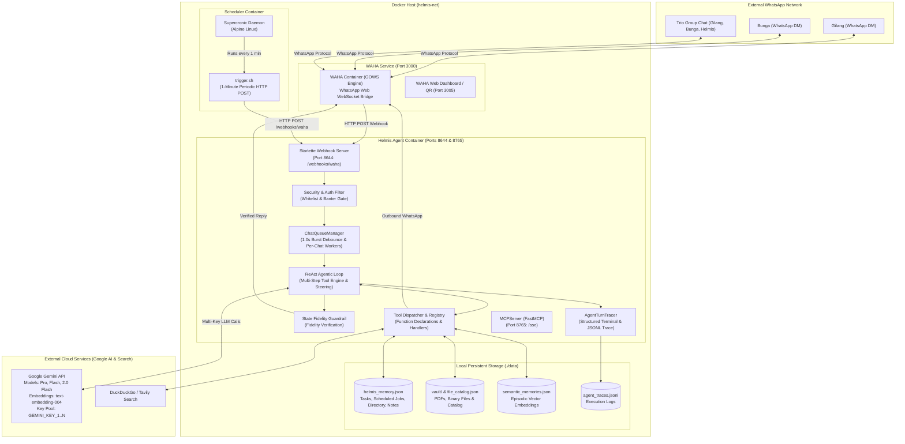
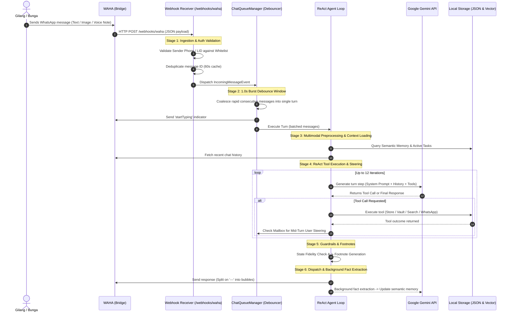

# System Architecture & Component Design

This document details the architectural design of **Helmis**, covering high-level system topology, domain modularity, container orchestration, network routing, and the end-to-end turn execution lifecycle.

---

## 1. System Topology Overview

Helmis operates 24/7 on a private server (VPS). It bridges WhatsApp communication via WAHA with Google Gemini LLMs, atomic local storage, and a vector semantic memory store.



---

## 2. Domain-Driven Package Layout

The agent codebase is organized into 4 distinct domain packages under `helmis-agent/src/`:

```
helmis-agent/src/
├── agent/                  # Brain, ReAct Loop & Cascade Orchestration
│   ├── cascade.py          # Gemini model fallback cascade & multi-key rotation
│   ├── guardrails.py       # State fidelity verification & footnote chips
│   ├── loop.py             # Autonomous multi-step ReAct agent loop & mailbox steering
│   ├── proactive.py        # Proactive reminder evaluator, 2-stage lead buffer & nag loops
│   ├── tracer.py           # Structured execution tracer & ANSI debugging
│   └── __init__.py
├── memory/                 # Storage, Episodic Memory & Vault
│   ├── semantic.py         # Vector embeddings & semantic memory search
│   ├── store.py            # JSON-backed tasks, people, schedules & notes
│   ├── vault.py            # Document vault, catalog, categorization & PDF extractor
│   └── __init__.py
├── whatsapp/               # WhatsApp / WAHA Integration
│   ├── client.py           # HTTP client with retry & rate limiting
│   ├── history.py          # Message deduplication & multi-turn history builder
│   ├── models.py           # WAHA & WhatsApp Pydantic models
│   ├── parser.py           # Payload, quoted message & identity resolution
│   ├── processor.py        # Batched turn processor, watchdog & bubble splitter
│   ├── queue.py            # Per-chat FIFO queue & 1.0s debouncer
│   ├── transcribe.py       # Audio & voice note transcription
│   ├── webhook.py          # Starlette HTTP controller (< 120 LOC)
│   └── __init__.py
├── tools/                  # Function Tool Declarations & Handlers
│   ├── contacts.py         # Contact lookup & storage tool
│   ├── files.py            # Document vault tool handlers
│   ├── mcp_export.py       # FastMCP SSE tool registration
│   ├── memory.py           # Semantic memory tool handlers
│   ├── notes.py            # Quick notes tool handlers
│   ├── registry.py         # Tool registry decorator & dispatcher
│   ├── schema.py           # Gemini Tool function declarations
│   ├── search.py           # Live DuckDuckGo / Tavily web search engine
│   ├── tasks.py            # Task & reminder tool handlers
│   ├── web.py              # Web search tool handler
│   ├── whatsapp.py         # WhatsApp message sending tool handlers
│   └── __init__.py
├── server.py               # Main runtime entry point (FastMCP SSE & Webhook runner)
└── __init__.py             # Package exports
```

---

## 3. Container Network & Deployment Topology

Orchestrated via `docker-compose.yml` on a shared bridge network (`helmis-net`):

### Services & Port Mappings

| Container Name | Base Image / Context | Internal Port | Exposed Port | Purpose |
|---|---|---|---|---|
| `helmis-waha` | `devlikeapro/waha:latest` | `3000` | `3005:3000` | WhatsApp Web WebSocket bridge (GOWS engine) + Dashboard |
| `helmis-agent` | `./helmis-agent` (Python 3.12-slim) | `8644`, `8765` | `8644` (Internal), `8765` (Internal) | Core AI ReAct Brain, Webhooks, Storage, FastMCP SSE server |
| `helmis-scheduler` | `./scheduler` (Alpine Linux) | N/A | N/A | Crontab runner triggering proactive check evaluations |

### Persistent Volume Layout

```
Host Filesystem
├── ./data/                                  <== Mounted into /app/data:z
│   ├── helmis_memory.json                   # Structured persistent state (tasks, notes, contacts)
│   ├── file_catalog.json                    # Metadata catalog for Document Vault
│   ├── vault/                               # Binary PDFs, photos, scans, receipts & workspaces
│   ├── semantic_memories.json               # Episodic vector embeddings & facts
│   └── agent_traces.jsonl                   # Step-by-step turn execution traces
│
├── ./config/                                <== Mounted into /app/config:ro,z
│   ├── system-prompt.md                     # 100% Single Source of Truth System Prompt
│   └── skills/                              # Specialized secretary playbooks (Markdown)
│
└── waha-sessions (Docker Volume)            <== Mounted into /app/.sessions
    └── ...                                  # WhatsApp Web token session files
```

---

## 4. End-to-End Turn Execution Lifecycle


