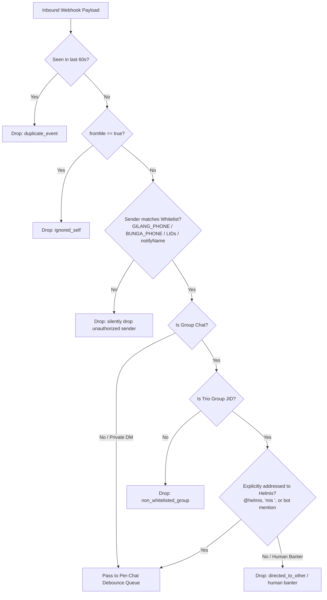
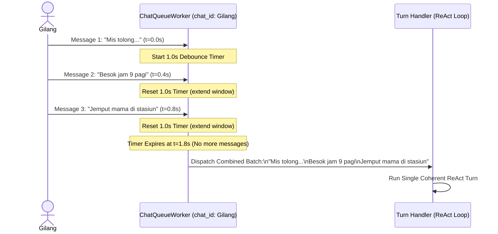

# Communication, Webhooks & Per-Chat Queues

This document provides a technical deep dive into Helmis's communication infrastructure: the WAHA REST API client, the Starlette webhook server, multi-filter security authorization, group chat discretion, and the asynchronous per-chat burst debouncing queue.

---

## 1. WAHA REST API Client (`WahaClient`)

The `WahaClient` class (`helmis-agent/src/client.py`) is the sole HTTP abstraction layer interfacing with the WhatsApp HTTP API bridge (**WAHA**). No other component in the codebase makes raw HTTP calls to WAHA.

```
                    ┌─────────────────────────┐
                    │       WahaClient        │
                    │  (Async HTTPX Client)   │
                    └────────────┬────────────┘
                                 │
     ┌───────────────────────────┼───────────────────────────┐
     │                           │                           │
     ▼                           ▼                           ▼
POST /api/sendText          POST /api/sendFile          GET /api/messages
(Text Messages & Quotes)    (Images, PDFs & Voice)      (Recent Chat History)
     │                           │                           │
     ▼                           ▼                           ▼
POST /api/startTyping       POST /api/stopTyping        GET /health
(Typing Indicator On)       (Typing Indicator Off)      (Bridge Reachability)
```

### Construction Patterns

1. **Synchronous Factory (`from_env_sync`)**:
   - Used at application boot (`server.py`) to create a shared client instance.
   - Reads `WAHA_BASE_URL`, `WAHA_API_KEY`, and `WAHA_SESSION_NAME` (defaults to `"helmis"`).
2. **Async Context Manager (`from_env`)**:
   - Used in unit/integration tests and CLI scripts to guarantee clean teardown of the underlying `httpx.AsyncClient`.

### Key Methods

| Method | Endpoint | Description |
|---|---|---|
| `send_message(chat_id, text, reply_to_message_id)` | `POST /api/sendText` | Sends plain text to a DM (`<phone>@c.us`) or group (`<id>@g.us`). Supports quoting via `reply_to`. |
| `send_media(chat_id, media_url, caption, reply_to_message_id)` | `POST /api/sendFile` | Sends media files by public or container-internal URL. |
| `get_messages(chat_id, limit)` | `GET /api/{session}/chats/{id}/messages` | Retrieves recent chronological message history. |
| `start_typing(chat_id)` | `POST /api/startTyping` | Triggers the WhatsApp `"typing..."` presence indicator in chat. |
| `stop_typing(chat_id)` | `POST /api/stopTyping` | Clears the typing presence indicator. |
| `download_media_base64(media_url)` | `GET {media_url}` | Downloads binary audio/image attachments and returns `(mime_type, base64_data)`. |
| `is_reachable()` | `GET /health` | Validates WAHA connectivity during container healthchecks. |

---

## 2. Starlette Webhook Server Architecture

The webhook receiver (`helmis-agent/src/webhook.py`) runs as a lightweight Starlette ASGI application hosted by Uvicorn inside a dedicated background thread on port `8644`.

### Endpoint Routing Table

```
Port 8644
├── GET  /health              --> Health status (returns 200 OK if WAHA is reachable, 503 if unreachable)
├── GET  /ping                --> Alias for /health (used by Docker Compose healthchecks)
├── POST /webhooks/waha       --> Inbound message events from WAHA bridge
└── POST /webhooks/scheduler  --> Periodic proactive cron trigger ticks from scheduler container
```

---

## 3. Security & Multi-Filter Authorization Engine

To protect private data, Helmis implements strict multi-stage authorization filters on all inbound webhook payloads.



### Filter Rules

1. **Deduplication Filter (`is_duplicate_message`)**:
   - In-memory cache stores message IDs with timestamps. Re-delivered webhook payloads within 60 seconds are dropped immediately.
2. **Strict Whitelist Resolution**:
   - Compares sender phone numbers, author participants, notify names, and WhatsApp Linked Device Identifiers (`LIDs`) against `GILANG_PHONE` and `BUNGA_PHONE`.
   - Any message from an unauthorized contact is dropped with HTTP 200 `{"status": "ignored_unauthorized_sender"}` without invoking LLM or storage.
3. **Non-Whitelisted Group Filtration**:
   - Group messages originating from groups other than `TRIO_GROUP_JID` are silently ignored.
4. **Group Chat Banter Filter**:
   - In the Trio group chat, Helmis will only trigger if:
     - The message text contains `"helmis"` (case-insensitive), or
     - The message text starts with `"mis "`, `"mis,"`, or `"mis?"`, or
     - Helmis's WhatsApp number is explicitly tagged in `mentionedIds`.
   - If Gilang and Bunga are conversing with each other or mention each other (`@gilang`, `@bunga`), Helmis remains silent.

---

## 4. Per-Chat Asynchronous Queue & Burst Debouncer

In human WhatsApp messaging, users frequently send thoughts across multiple short, rapid messages (e.g., line 1: *"Mis tolong"*, line 2: *"Besok jam 9 pagi"*, line 3: *"Jemput mama di stasiun"*).

Processing each message as an independent LLM turn leads to race conditions, partial responses, and excessive API usage. Helmis solves this with the `ChatQueueManager` and `ChatQueueWorker` (`helmis-agent/src/queue.py`).



### Queue Architecture Details

- **Independent Worker Tasks**: Every `chat_id` has its own `asyncio.Queue` and dedicated background worker loop.
- **Concurrent Chat Isolation**: Gilang's DM, Bunga's DM, and the Trio Group Chat execute in parallel. A long-running turn in one chat does not block processing in another.
- **Sequential FIFO within Chat**: Consecutive messages within the same chat are guaranteed to execute sequentially without race conditions.
- **Burst Debounce Algorithm**: When a message arrives, the worker enters a debounce loop, sleeping in small intervals (20–50ms) and checking for new messages. As long as messages arrive within 1.0 second of each other, they are coalesced into a single array of `IncomingMessageEvent` objects and processed as a unified turn.

---

## 5. Quoted Message & Reply Payload Architecture

WhatsApp users frequently quote or swipe-reply to prior messages, voice notes, photos, and system responses. WAHA represents quotes differently depending on whether it runs the GOWS (Go WebSocket) engine or WebJS/Noweb engine. Helmis implements engine-agnostic quote extraction (`extract_quoted_info` in `helmis-agent/src/webhook.py`).

### Supported Payload Structures

```
WAHA Webhook Payload
├── 1. Top-Level 'replyTo' (WAHA Generic)
│   ├── body / caption: Quoted plain text
│   ├── type: 'chat', 'ptt', 'audio', 'image', 'document'
│   └── participant / from: Sender JID
│
├── 2. Raw WebJS '_data.quotedMsg' (WhatsApp Web Engine)
│   ├── body / caption: Quoted text
│   ├── type: Message type
│   └── _data.quotedParticipant: Sender JID
│
└── 3. GOWS Protobuf '_data.Message.extendedTextMessage.contextInfo' (Go WebSocket Engine)
    ├── participant: Sender JID
    └── quotedMessage:
        ├── audioMessage: { seconds: 8, ptt: true, mimetype: "audio/ogg" }  ──► "Pesan Suara / Voice Note (8 detik)"
        ├── imageMessage: { caption: "...", mimetype: "image/jpeg" }       ──► "Foto / Gambar: Caption"
        ├── conversation / extendedTextMessage: { text: "..." }            ──► Plain text quote
        ├── documentMessage: { title: "...", fileName: "..." }             ──► "Dokumen: filename.pdf"
        └── stickerMessage: { ... }                                        ──► "Stiker"
```

### Multimodal Quoting & Prompt Formatting

When a message with a quote is debounced, Helmis prefixes the user's turn with standard WhatsApp markdown blockquote formatting:

```text
> [Bunga]: "Pesan Suara / Voice Note (8 detik)"

coba apa yang gw quote
```

If a quoted voice note has a direct download URL, Phase 1 automatically downloads and transcribes the audio into the quote header:
```text
> [Bunga]: "Pesan Suara (Voice Note): \"Jangan lupa bayar tagihan ya\""

maksudnya gimana?
```

### Group Chat Quoting Trigger
If a user quotes any message previously sent by Helmis in the Trio Group Chat (`quoted_sender == "Helmis"`), the message is treated as explicitly directed to Helmis, triggering an immediate response even if `@Helmis` was not typed.

### Strict Anti-Hallucination Guardrail
System instructions enforce that Gemini must look *only* at the `> [Sender]: ...` block in the current turn. If the user asks what was quoted and no quote block exists in the prompt, Helmis must state truthfully: *"Tidak ada pesan atau media yang ter-quote pada pesan ini"* rather than inventing a fictional quote from chat history.

