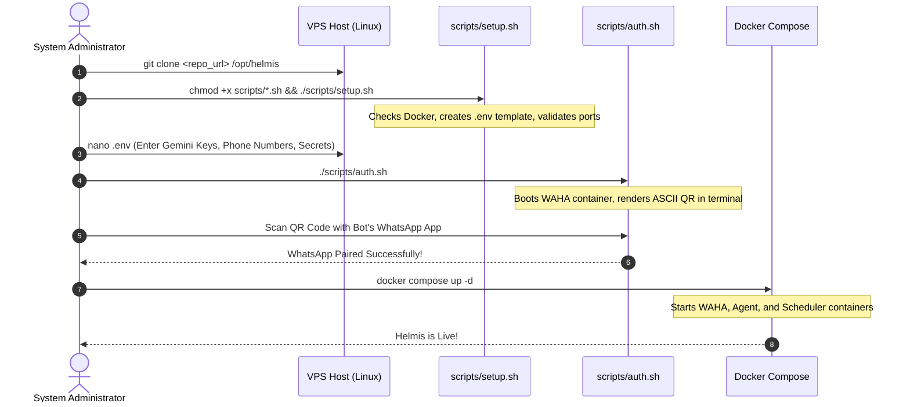

# Deployment, Operations & Troubleshooting

This document provides a production runbook for provisioning, deploying, operating, and troubleshooting Helmis on a Linux Virtual Private Server (VPS).

---

## 1. System Requirements & Prerequisites

### Hardware Requirements
- **CPU**: Minimum 2 cores (4 cores recommended for low-latency multimodal OCR).
- **RAM**: Minimum 4 GB (6 GB recommended for concurrent WhatsApp Web sessions and FastMCP).
- **Disk**: Minimum 20 GB SSD.
- **OS**: Linux (Ubuntu 22.04 / 24.04 LTS or Debian 12 recommended).

### Software Requirements
- **Docker Engine**: Version 24.0 or newer.
- **Docker Compose**: Version 2.20 or newer (`docker compose` v2 plugin).
- **Network**: Outbound access on ports 80/443 (WhatsApp Web & Google Gemini API).

---

## 2. Step-by-Step First-Time Deployment



### 1. Clone the Repository
```bash
git clone https://github.com/your-username/helmis.git /opt/helmis
cd /opt/helmis
```

### 2. Run Setup Script
```bash
chmod +x scripts/*.sh
./scripts/setup.sh
```

### 3. Configure Environment Variables
Edit `.env` and fill in your production credentials:
```bash
nano .env
```
Ensure the following are populated:
- `GEMINI_KEY_1`, `GEMINI_KEY_2`, `GEMINI_KEY_3`
- `WAHA_API_KEY`
- `GILANG_PHONE`, `BUNGA_PHONE`, `BOT_PHONE`
- `TZ=Asia/Jakarta`

### 4. Authenticate WhatsApp in Terminal
Run the dedicated authentication script:
```bash
./scripts/auth.sh
```
- A large ASCII QR code will appear directly in your terminal.
- Open WhatsApp on the bot's phone $\rightarrow$ **Linked Devices** $\rightarrow$ **Link a Device** $\rightarrow$ Scan the terminal QR code.
- Once paired, the script will confirm pairing and exit cleanly.

### 5. Start All Services
```bash
docker compose up -d
```

### 6. Verify Health Status
```bash
docker compose ps
```
All three containers (`helmis-waha`, `helmis-agent`, `helmis-scheduler`) should display status `Up (healthy)` or `Up`.

---

## 3. Operations & Maintenance Playbook

### Viewing Real-Time Logs

```bash
# View live agent reasoning trace and tool calls
docker compose logs -f agent

# View WhatsApp bridge logs
docker compose logs -f waha

# View proactive scheduler tick logs
docker compose logs -f scheduler

# View all container logs combined
docker compose logs -f
```

### Restarting Services

```bash
# Restart the agent brain (after prompt or code changes)
docker compose restart agent

# Restart the WhatsApp bridge
docker compose restart waha

# Graceful restart of all services
docker compose restart
```

### Adding New Gemini API Keys

To expand your quota pool:
1. Add the new key to `.env`:
   ```bash
   GEMINI_KEY_4=AIzaSy...
   ```
2. Restart the agent container:
   ```bash
   docker compose up -d agent
   ```
3. The agent dynamically picks up all environment variables starting with `GEMINI_KEY_` on startup.

### Upgrading / Rebuilding the Codebase

```bash
cd /opt/helmis
git pull origin main
docker compose build agent
docker compose up -d agent
```

---

## 4. Backup & Disaster Recovery

Helmis stores all operational data, notes, and vector embeddings in `./data/`.

### Creating a Manual Backup
```bash
# Saves compressed archive to ./backups/helmis_backup_YYYYMMDD_HHMMSS.tar.gz
./scripts/backup.sh

# Or back up to an external mount path
./scripts/backup.sh /mnt/backups/helmis
```

### Automating Daily Backups (Host Crontab)
Add the following line to the host root crontab (`crontab -e`):
```cron
0 3 * * * /opt/helmis/scripts/backup.sh /var/backups/helmis >> /var/log/helmis-backup.log 2>&1
```

### Disaster Recovery / Restoration Runbook
To restore Helmis on a fresh server:
1. Provision Docker and clone the repository.
2. Extract the backup archive over the project directory:
   ```bash
   tar -xzvf helmis_backup_YYYYMMDD_HHMMSS.tar.gz -C /opt/helmis/
   ```
3. Re-link WhatsApp if needed (`./scripts/auth.sh`).
4. Start the stack:
   ```bash
   docker compose up -d
   ```

---

## 5. Production Troubleshooting Matrix

| Symptom | Probable Cause | Diagnostic Command | Remediation |
|---|---|---|---|
| **WhatsApp session expired / Bot offline** | Phone logged out or token invalidated | `docker compose logs waha` | Run `./scripts/auth.sh` to rescan the QR code in terminal, or access `http://localhost:3000/dashboard` via SSH tunnel. |
| **Agent returns "gangguan koneksi ke AI provider"** | All Gemini keys in pool hit rate limit (429) or are invalid | `docker compose logs agent \| grep "429"` | Add additional keys (`GEMINI_KEY_4`, `GEMINI_KEY_5`) to `.env` and restart `agent`. |
| **Messages from Gilang/Bunga ignored** | Sender phone format mismatch or unlisted LID | `docker compose logs agent \| grep "unauthorized"` | Check clean phone number in `.env` (must start with country code `62...` without `+` or spaces). |
| **Voice note reply says "Audio tidak terdengar jelas"** | Silent audio, low volume, or unsupported audio codec | `docker compose logs agent \| grep "Phase 1"` | Ensure WAHA downloaded the media binary. If silent, ask user to re-record in quiet environment. |
| **Scheduler ticks fail (HTTP 500 / Timeout)** | Agent container unreachable from scheduler container | `docker compose logs scheduler` | Verify `helmis-agent` is healthy and listening on port 8644. Check `docker network inspect helmis-net`. |
| **Memory file permission error** | `./data` directory owned by root without container write access | `ls -la data/` | Run `chmod -R 775 data/` on host. |
| **Group chat messages ignored** | Message did not mention Helmis or bot phone not in `@mentions` | `docker compose logs agent \| grep "directed_to_other"` | Normal behavior (Banter Filter). Instruct users to prefix messages with `"Helmis"` or `"mis "`. |
