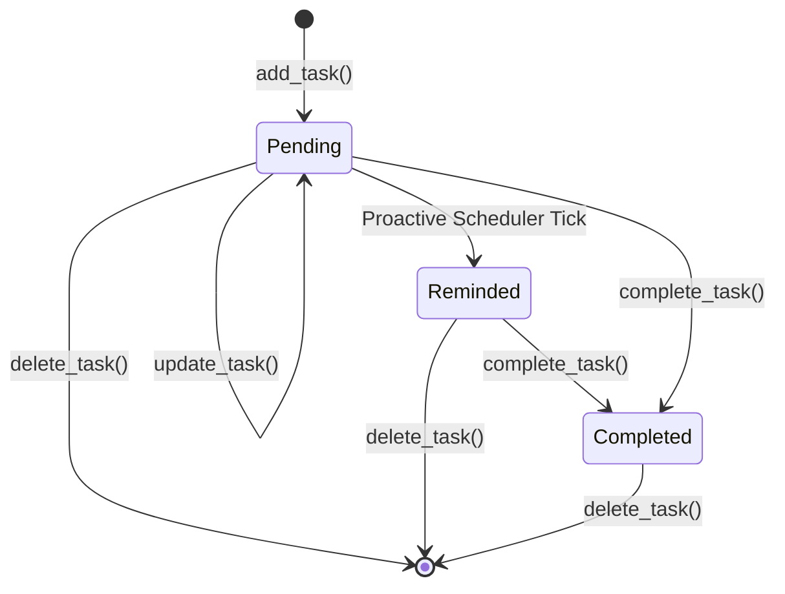
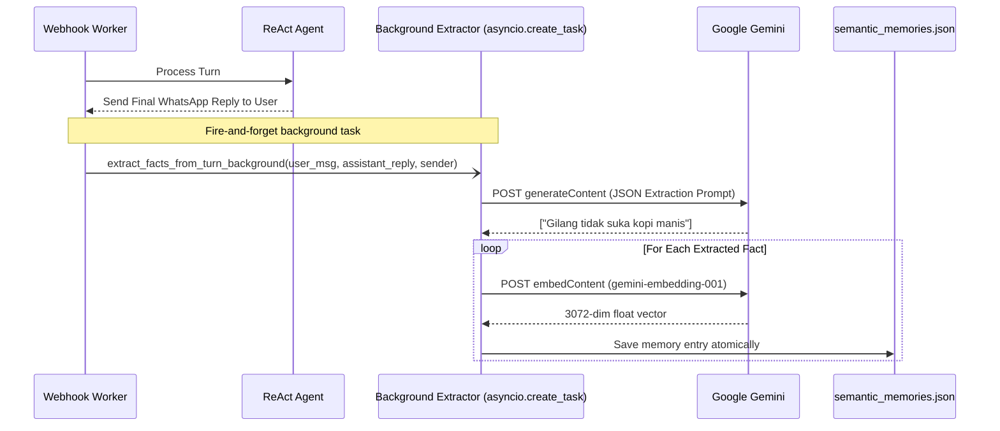

# Memory Architecture & Semantic Vector Store

This document provides a technical deep dive into Helmis's dual-layer persistence system: the structured JSON store for deterministic operational state and the vector-backed semantic episodic store for long-term user preferences and biographical context.

---

## 1. Unified Brain Design Philosophy

Helmis operates with **one unified brain** serving two principals: **Gilang** and **Bunga**.

```
                ┌─────────────────────────────────────────┐
                │          Helmis Unified Memory          │
                └────────────────────┬────────────────────┘
                                     │
                 ┌───────────────────┴───────────────────┐
                 │                                       │
        ┌────────┴────────┐                     ┌────────┴────────┐
        │ Structured JSON │                     │ Semantic Vector │
        │  Operational    │                     │  Episodic &     │
        │     Store       │                     │  Preferences    │
        └────────┬────────┘                     └────────┬────────┘
                 │                                       │
     ├── Tasks & Deadlines                   ├── Personal Preferences
     ├── People Directory                    ├── Dietary & Health Habits
     ├── Shared Notes & Lists                ├── Historical Facts
     └── Sent Activity Logs                  └── Relationships Context
```

### Context Visibility & Discretion Rules
1. **Shared State by Default**: Tasks, appointments, household lists, and contact directories are fully shared. If Gilang notes a dentist appointment, Helmis can answer Bunga when she asks about the week's schedule.
2. **Context Discretion in DMs**: In private direct messages, Helmis addresses the user personally and does not volunteer irrelevant private context from the other user unless directly requested.
3. **Sender Attribution**: All tasks and facts are tagged with the creator/assignee (`user_id: "Gilang" | "Bunga" | "Both"`).

---

## 2. Structured Operational Store (`helmis_memory.json`)

All operational data (tasks, schedule, directory, notes, activity logs) is persisted on disk in `/app/data/helmis_memory.json`.

### Concurrency & Thread-Safe Atomic Writes

To prevent file corruption during simultaneous read/write operations across webhook threads, `memory.py` implements a reentrant lock and an atomic write pattern:

```python
_memory_lock = threading.Lock()

def _save_memory_unlocked(data: dict[str, Any]) -> None:
    tmp_file = f"{MEMORY_FILE}.tmp.{os.getpid()}"
    try:
        with open(tmp_file, "w", encoding="utf-8") as f:
            json.dump(data, f, indent=2, ensure_ascii=False)
            f.flush()
            os.fsync(f.fileno())  # Flush hardware buffers to disk
        os.replace(tmp_file, MEMORY_FILE)  # Atomic POSIX rename
    except Exception as e:
        log.error("Failed to save memory file (%s): %s", MEMORY_FILE, e)
        if os.path.exists(tmp_file):
            try:
                os.remove(tmp_file)
            except Exception:
                pass
```

### Schema Definitions

```json
{
  "tasks": [
    {
      "title": "Perpanjang STNK motor",
      "due": "2026-08-28 10:00 WIB",
      "assignee": "Gilang",
      "status": "pending",
      "reminded": false,
      "created_at": "Tuesday, 25 August 2026 - 14:00 WIB",
      "updated_at": "Tuesday, 25 August 2026 - 14:30 WIB"
    }
  ],
  "people": {
    "Dr. Andi": {
      "phone": "62811223344",
      "role": "Dokter Gigi Keluarga",
      "notes": "Praktek di RS Pondok Indah, Senin & Kamis",
      "updated_at": "Monday, 24 August 2026 - 09:15 WIB"
    }
  },
  "notes": [
    {
      "title": "Belanja Mingguan",
      "content": "1. Telur omega\n2. Susu oat\n3. Kopi arabika",
      "created_at": "Sunday, 23 August 2026 - 19:20 WIB"
    }
  ],
  "activity_log": [
    {
      "time": "Tuesday, 25 August 2026 - 07:30 WIB",
      "summary": "Proactive reminder sent to Gilang for 'Check in Asah': \"Halo Gilang, pengingat...\""
    }
  ]
}
```

---

## 3. Task Lifecycle State Machine

Tasks progress through a deterministic lifecycle managed by CRUD tools:



### Transition Invariants
- **`pending`**: Task is active. Evaluated by scheduler on every proactive tick.
- **`reminded: true`**: Proactive reminder has been delivered to the assignee's WhatsApp. Prevents duplicate spam on subsequent cron ticks.
- **`completed`**: User confirmed completion. Filtered out of proactive checks and active prompt summaries.
- **`deleted`**: Item purged completely from JSON store.

---

## 4. Semantic Vector Store (`semantic_memories.json`)

Personal preferences, habits, health facts, and biographical background are stored in `/app/data/semantic_memories.json` as dense vector embeddings.

### Vector Embeddings Pipeline
1. **Model**: Google `gemini-embedding-001`.
2. **Dimensionality**: 3072 floating-point dimensions.
3. **Key Pool Rotation**: Embedding requests use the same round-robin key pool as generative calls (`get_next_gemini_key()`), automatically recovering from 429 quota exhaustion.

### Cosine Similarity Computation

```python
def cosine_similarity(v1: list[float], v2: list[float]) -> float:
    if len(v1) != len(v2) or not v1 or not v2:
        return 0.0
    dot = sum(a * b for a, b in zip(v1, v2, strict=True))
    norm1 = math.sqrt(sum(a * a for a in v1))
    norm2 = math.sqrt(sum(b * b for b in v2))
    if norm1 == 0 or norm2 == 0:
        return 0.0
    return dot / (norm1 * norm2)
```

### Semantic Search & Retrieval (`search_memories`)
When a conversation turn starts, Helmis queries semantic memory:
- Filter by `user_id` (matches sender, `"Both"`, or `"all"`).
- Compute cosine similarity against all stored memory vectors.
- Return top $k=5$ memories satisfying minimum similarity threshold (default `min_score = 0.62` for prompt injection, `min_score = 0.65` for explicit recall).
- Inject matching facts into the system instruction under `### RELEVANT PERSONAL PREFERENCES & LONG-TERM MEMORY:`.

---

## 5. Automatic Background Episodic Fact Extractor

Inspired by Mem0, Helmis passively extracts durable personal facts from conversational turns without blocking the user response.



### Extraction Guidelines
The extraction prompt strictly filters out temporary chatter and retains only durable knowledge:
- **Included**: Dietary restrictions, personal preferences, family member names, recurring habits, vehicle specs, ongoing long-term goals.
- **Excluded**: One-off greetings, transient task requests (handled by task engine), ephemeral logistics ("I am at the lobby").

---

## 6. Two-Pass Memory Deletion Algorithm (`delete_memory`)

Deleting memories requires handling both explicit keyword matches and conceptual semantic matches:

1. **Pass 1 (Token & Substring Match)**:
   - Evaluates whether query tokens match the stored text verbatim.
2. **Pass 2 (Semantic Similarity Fallback)**:
   - If Pass 1 finds 0 matches, computes vector embedding of the deletion query.
   - Identifies any stored memories with cosine similarity $\ge 0.78$.
   - Purges matched memories from storage and returns the count of deleted items.
