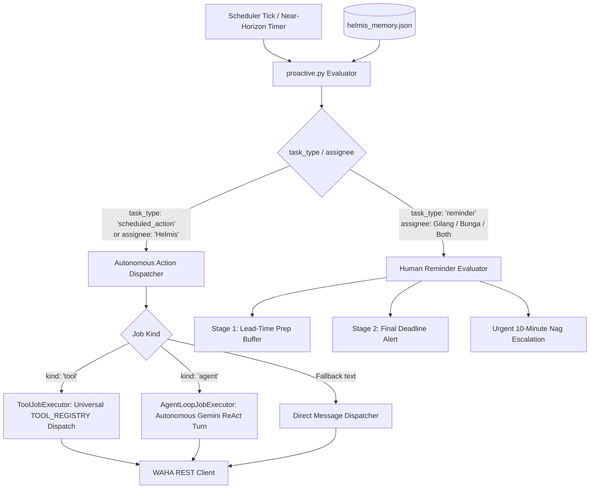

# Proactive Engine & Scheduled Execution Architecture

This document details the background proactive and scheduling engine of Helmis, covering the **1-Minute Cron Daemon**, **Polymorphic Job Executors (`ToolJobExecutor` & `AgentLoopJobExecutor`)**, **Near-Horizon Exact-Second Timers**, **Multi-Stage Lead-Time Buffering**, and **Urgent Nag Escalation Loops**.

---

## 1. Scheduler Topology & Precision

The proactive engine operates as an independent background container (`helmis-scheduler`) orchestrated in `docker-compose.yml`, communicating with `helmis-agent` over the internal Docker network.

```
┌────────────────────────────────────────────────────────┐
│  helmis-scheduler Container (Alpine Linux)             │
│                                                        │
│  Supercronic Cron Daemon                               │
│  └── Every 1 minute (* * * * *)                        │
│      └── /app/trigger.sh                               │
│          └── HTTP POST /webhooks/waha (scheduler.tick) │
└───────────────────────────┬────────────────────────────┘
                            │ Internal HTTP POST
                            ▼
┌────────────────────────────────────────────────────────┐
│  helmis-agent Container (Python ReAct & FastAPI)       │
│                                                        │
│  Webhook Route: /webhooks/waha                         │
│  └── Proactive Engine (`src/agent/proactive.py`)       │
│      ├── Evaluates due bot jobs & human reminders      │
│      ├── Dispatches tools / agent turns / reminders    │
│      └── Dispatches via WAHA REST API                  │
└────────────────────────────────────────────────────────┘
```

---

## 2. Polymorphic Scheduled Action Engine

Helmis supports true **autonomous delayed execution** for bot actions in addition to human todo reminders. Tasks are categorized by `task_type`:



### Strategy 1: `ToolJobExecutor` (Deterministic Tool Execution)
- Used for scheduled operations that map directly to any registered tool in `TOOL_REGISTRY` (e.g. `send_whatsapp_message`, `send_vault_file`, `search_web`, `manage_note`).
- When due, `execute_tool_call` runs dynamically with tool arguments.
- Any future tool added to Helmis is automatically supported with zero scheduler changes.

### Strategy 2: `AgentLoopJobExecutor` (Generative / Reasoning Turn)
- Used for dynamic tasks requiring live reasoning or research at execution time (e.g., *"Besok jam 7 pagi rangkum cuaca dan kirim ke grup"* or *"Rekap task selesai minggu ini"*).
- When due, wakes up `run_agentic_react_loop` with a synthetic prompt and target chat.

### Strategy 3: Near-Horizon Exact-Second Timers (`asyncio.sleep`)
- For schedules due within the next 10 minutes ($\le 600\text{s}$, e.g. *"Kirim dalam 30 detik"* or *"Kirim 2 menit lagi"*), Helmis spawns an in-process asyncio delay timer.
- Executes at the **exact second ($T \pm 0.05\text{s}$)**, while the 1-minute cron acts as a persistent fallback safety net.

---

## 3. Human Task & Reminder Lifecycle

For personal tasks belonging to Gilang, Bunga, or Both (`task_type="reminder"`):

```
[Now] ──────► [Stage 1: Lead-Time Buffer] ──────► [Stage 2: Due Alert] ──────► [Stage 3: Nag Escalation]
                   (Heads-up prep window)              (Deadline reached)           (Urgent 10m nudge loop)
```

### Stage 1: Preparation Lead-Time Window
- Automatically calculated from `lead_time_minutes` (e.g. 120m for assignments, 180m for flights, 30m for meetings).
- Dispatches a preparatory ping so the user has time to work before the cutoff.

### Stage 2: Final Deadline Alert
- Dispatched when the deadline arrives.

### Stage 3: Urgent 10-Minute Nag Loop & Partner Cross-Alert
- For tasks marked `priority="urgent"`:
  - **10m, 20m**: Direct follow-up nudges to the assignee.
  - **30m**: **Cross-Partner Alert** (notifies the partner to help check or wake them up).
  - **40m, 50m**: Final urgent follow-ups.
  - **60m**: Automatic stand-down notice.

---

## 4. Downtime Catch-Up & Anti-Spam Expiration

- **Overdue $< 2\text{ hours}$**: Dispatched with a subtle notice (`[Pesan Terjadwal Tertunda]`).
- **Overdue $> 2\text{ hours}$**: Marked `expired` silently to prevent spamming stale messages upon long server downtime.
- **Anti-Interference**: Bot actions (`task_type="scheduled_action"`) strictly bypass human lead buffers and nag loops, auto-completing immediately upon execution.
