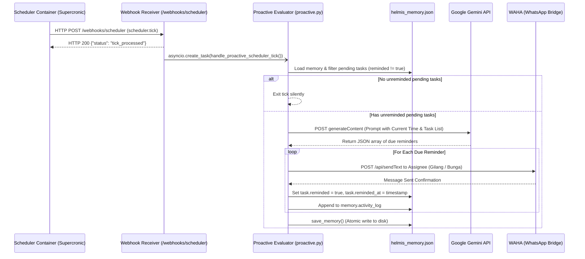

# Proactive Reminder & Scheduler Subsystem

This document details Helmis's proactive intelligence engine: the cron container architecture, periodic trigger delivery, the LLM-driven proactive evaluator, and WhatsApp reminder dispatch.

---

## 1. Scheduler Container Architecture

Proactive triggers are decoupled from the main agent container into a dedicated, lightweight cron service (`helmis-scheduler`).

```
                    ┌─────────────────────────┐
                    │    helmis-scheduler     │
                    │ (Alpine + Supercronic)  │
                    └────────────┬────────────┘
                                 │
                     Executes trigger.sh on schedule
                                 │
                                 ▼
                     POST /webhooks/scheduler
                     {"event": "scheduler.tick"}
                                 │
                                 ▼
                    ┌─────────────────────────┐
                    │      helmis-agent       │
                    │  (Proactive Evaluator)  │
                    └─────────────────────────┘
```

### Components

1. **Base Image & Process Supervisor**:
   - Built on `alpine:3.20` with `supercronic` (a cron implementation designed specifically for containers that handles SIGTERM cleanly and logs to stdout).
2. **Crontab (`scheduler/crontab`)**:
   ```cron
   # Run proactive reminder check every 5 minutes
   */5 * * * * /app/trigger.sh
   ```
3. **Trigger Script (`scheduler/trigger.sh`)**:
   - A POSIX shell script that issues an HTTP POST request to `HERMES_WEBHOOK_URL` (resolving to `http://agent:8644/webhooks/scheduler` within `helmis-net`).
   - Sends payload: `{"event": "scheduler.tick", "timestamp": "<ISO-8601>", "source": "cron"}`.

---

## 2. Proactive Evaluator (`handle_proactive_scheduler_tick`)

When `helmis-agent` receives the `scheduler.tick` event on port 8644, `webhook.py` dispatches `handle_proactive_scheduler_tick()` as a non-blocking background task.



---

## 3. Due Task Evaluation & Prompt Design

The evaluator provides Gemini with the exact current Jakarta local time (`WIB`) and the active unreminded tasks list.

### Evaluation Criteria
A task warrants a proactive reminder if:
1. It is scheduled within the next 30 minutes, or
2. It is due right now or earlier today (overdue), and
3. It has not already been reminded (`reminded: false`).

### Structured Generation Prompt

```
Current time in Jakarta: Tuesday, 25 August 2026 - 17:45 WIB
Tasks in storage:
[
  {
    "title": "Beli obat di apotek",
    "due": "2026-08-25 18:00 WIB",
    "assignee": "Gilang",
    "status": "pending"
  }
]

Task: Identify any pending task that is due within the next 30 minutes, or due right now (e.g. today or overdue), and has NOT been reminded yet (i.e. does not have "reminded": true).
If there are tasks that need a proactive reminder right now, output a JSON array of objects:
[
  {
    "title": "exact task title",
    "assignee": "Gilang or Bunga",
    "message": "Concise WhatsApp reminder text in Indonesian with ZERO EMOJIS, e.g. 'Halo Gilang, pengingat: *[task title]* (Waktu: [due]).'"
  }
]
If no reminders are due right now, output exactly: []
```

---

## 4. Reminder Delivery & Memory State Mutation

For each reminder returned by Gemini:
1. **Target JID Resolution**:
   - If assignee is Bunga: Target is `BUNGA_PHONE@c.us`.
   - If assignee is Gilang (or default): Target is `GILANG_PHONE@c.us`.
2. **WhatsApp Dispatch**:
   - `WahaClient.send_message(chat_id=target_jid, text=msg_text)`.
3. **State Mutation**:
   - The matching task in `helmis_memory.json` is updated with:
     ```json
     {
       "reminded": true,
       "reminded_at": "Tuesday, 25 August 2026 - 17:45 WIB"
     }
     ```
4. **Activity Logging**:
   - An entry is appended to `activity_log` in `helmis_memory.json`:
     ```json
     {
       "time": "Tuesday, 25 August 2026 - 17:45 WIB",
       "summary": "Proactive reminder sent to Gilang for 'Beli obat di apotek': \"Halo Gilang, pengingat: *Beli obat di apotek* (Waktu: 18:00 WIB).\""
     }
     ```
5. **Atomic Disk Flush**:
   - The updated memory object is flushed to disk via `save_memory()`, guaranteeing state persistence across container restarts.
